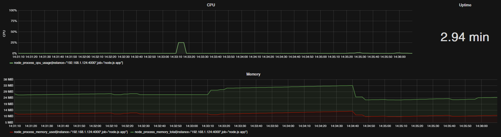

# prometheus-node-usage

> Exporter node.js application metrics (CPU, RAM and uptime).

[![MIT License][license-image]][license-url]
[![npm version][npmjs-image]][npmjs-url]
[![Build Status][travis-image]][travis-url]
[![Coverage Status][coveralls-image]][coveralls-url]
[![david-dm dependency Status][david-image]][david-url]
[![david-dm devDependency Status][david-dev-dependencies-image]][david-dev-dependencies-url]
[![Known Vulnerabilities][snyk-image]][snyk-url]



Exports metrics from a Node application. The library obtains data on CPU and memory on current process and creates a format to be used from the [Prometheus](https://prometheus.io/) tool. Format example:

    node_process_memory_used 4335264
    node_process_memory_total 8368128
    node_process_memory_rss 24854528
    node_process_cpu_usage 12.5
    node_process_uptime 0.256
    node_process_disk_io_read 132
    node_process_disk_io_write 12288

> metrics `node_process_disk_io_read` and `node_process_disk_io_write` are available linux system only.

## Getting started

```bash
$ npm install prometheus-node-usage
$ yarn add prometheus-node-usage
```

You can use **prometheus-node-usage** from your JavaScript project.

## Usage

```javascript
var metrics = require('prometheus-node-usage');

metrics.getMetricsAsync().then(function (metrics) {
    // use metrics in your soure code
});
```

```typescript
import { getMetricsAsync } from "prometheus-node-usage";
const metrics = await getMetricsAsync();
```
## License

This project is licensed under the MIT License - see the [LICENSE](LICENSE) file for details.

[license-image]: http://img.shields.io/badge/license-MIT-blue.svg?style=flat
[license-url]: LICENSE

[npmjs-image]: https://badge.fury.io/js/prometheus-node-usage.svg
[npmjs-url]: https://www.npmjs.com/package/prometheus-node-usage

[travis-image]: https://travis-ci.org/cyrilschumacher/prometheus-node-usage.svg
[travis-url]: https://travis-ci.org/cyrilschumacher/prometheus-node-usage

[coveralls-image]: https://coveralls.io/repos/github/cyrilschumacher/prometheus-node-usage/badge.svg?branch=master
[coveralls-url]: https://coveralls.io/github/cyrilschumacher/prometheus-node-usage?branch=master

[david-dev-dependencies-image]: https://david-dm.org/cyrilschumacher/prometheus-node-usage/dev-status.svg
[david-dev-dependencies-url]: https://david-dm.org/cyrilschumacher/prometheus-node-usage#info=devDependencies

[david-image]: https://david-dm.org/cyrilschumacher/prometheus-node-usage.svg
[david-url]: https://david-dm.org/cyrilschumacher/prometheus-node-usage

[snyk-image]: https://snyk.io/test/github/cyrilschumacher/prometheus-node-usage/badge.svg
[snyk-url]: https://snyk.io/test/github/cyrilschumacher/prometheus-node-usage